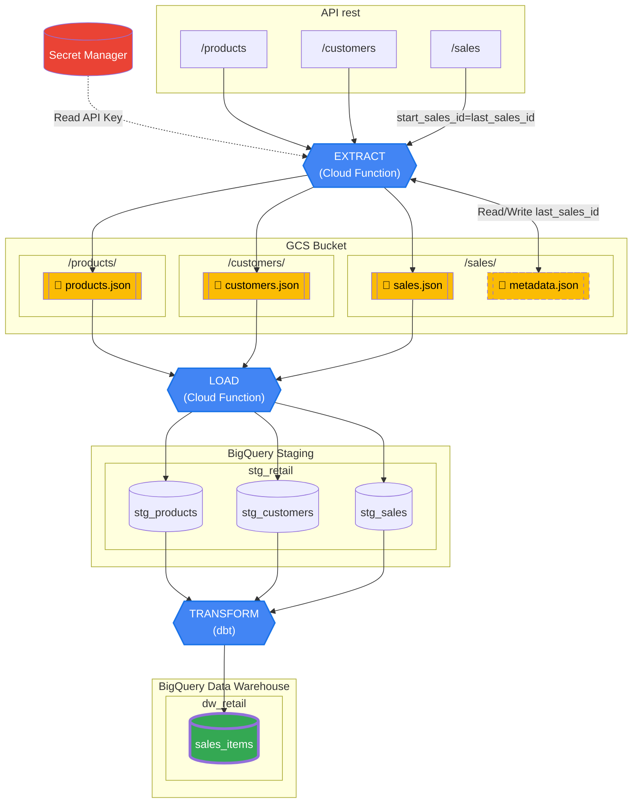

# Documentation Pipeline ELT


## STAGING

### stg_products

| Colonne | Type | Contraintes | Description | Exemple |
| :--- | :--- | :--- | :--- | :--- |
| `product_sku` | `STRING` | PRIMARY KEY | Identifiant unique du produit | 1001-ELC-X |
| `description` | `STRING` | | Détails du produit | Smartphone High-Tech 128GB |
| `unit_amount` | `FLOAT` | | Prix unitaire | 699.99 |
| `supplier` | `STRING` | | Nom du fournisseur | TechCorp |

### stg_customers

| Colonne | Type | Contraintes | Description | Exemple |
| :--- | :--- | :--- | :--- | :--- |
| `customer_id` | `STRING` | PRIMARY KEY | Identifiant unique du client | 100-JD-2024" |
| `emails` | `STRING[]` | | Emails du client | [m.leclerc@provider.net, marie.l@work.com] |
| `phone_numbers` | `STRING[]` | | Numeros de téléphone du client | [+33788990011, 0145678910] |

### stg_sales

| Colonne | Type | Contraintes | Description | Exemple |
| :--- | :--- | :--- | :--- | :--- |
| `id` | `INTEGER` | PRIMARY KEY | Identifiant de la vente (auto-incrémenté). | 10001 |
| `datetime` | `DATE` | | Date et heure de la transaction. | 2024-07-18 13:23:28 |
| `total_amount` | `FLOAT` | | Montant total de la transaction. | 949.49 |
| `customer_id` | `STRING` | | Identifiant unique du client. | 100-JD-2024 |
| `items` | `ARRAY<STRUCT<product_sku STRING, quantity INTEGER, amount FLOAT>>` | | Liste des produits (SKU, quantité, montant). | [ [1001-ELC-X, 1, 699.99] , [1002-ELC-X, 1, 249.50] ] |

## DATA WAREHOUSE

### dw_sales_items

| Colonne | Type | Contraintes | Description | Exemple |
| :--- | :--- | :--- | :--- | :--- |
| `id` | `INTEGER` | PRIMARY KEY | Clé primaire de la table | 10001 |
| `sales_datetime` | `DATE` | | Date de la vente | 2024-07-18 13:23:28  |
| `item_amount` | `FLOAT` | | Montant total par produit et par vente | 249.5 |
| `product_sku` | `STRING` | | SKU du produit vendu | 1001-ELC-X |
| `item_quantity` | `INTEGER` | | Nombre d'items vendus de ce produit | 1 |
| `product_description` | `STRING` | | Description du produit | Smartphone High-Tech 128GB |
| `discount_perc` | `FLOAT` | | % de discount entre le prix catalogue (stg_products) et le montant unitaire vendu | 0.0 


## Configuration de l'API
```bash
cd api
npm install
npx json-server@0.17.4 api.json --middlewares ./middleware.js --port 3000
```
Generer une url accessible depuis l'exterieur: 
```bash
ngrok http 3000
 ```
Copier cette url pour la mettre dans le fichier tf

## Configuration terraform

```bash
cd terraform
terraform apply --auto-approve
 ```

La pipeline s'execute toutes les 5 minutes par défaut 

Extract: Extrait les données depuis l'API rest vers le bucket GCS (json) -> fn-extract (Cloud function)

Load: Charge les données depuis le bucket GCS (json) vers des tables bigquery -> fn-load (Cloud function)

Transform: Effectue une transformation depuis ces tables bigquery vers une table BigQuery sales_items -> dbt run (TODO Cloud run jobs)

## Pour executer en local 
créer un fichier .env 
exemple de contenu:
```yaml
API_KEY="test"

API_URL="http://localhost:3000"
API_CUSTOMERS_URL="${API_URL}/customers"
API_PRODUCTS_URL="${API_URL}/products"
API_SALES_URL="${API_URL}/sales"

GCP_PROJECT_ID="stack-labs-data-engineer"
GCP_BUCKET_NAME="stack-labs-data-engineer-raw-data"
```

```bash
gcloud auth application-default login
```


# EXTRACT
```bash
cd extract
uv init
uv pip install python-dotenv google-cloud-storage
uv run python main.py
```
# LOAD
```bash
cd load
uv init
uv add python-dotenv google-cloud-storage google-cloud-bigquery google-cloud-pubsub
uv run python main.py
```
# TRANSFORM
```bash
cd transform
uv init
uv add dbt-bigquery
uv run dbt run --profiles-dir .dbt
```
